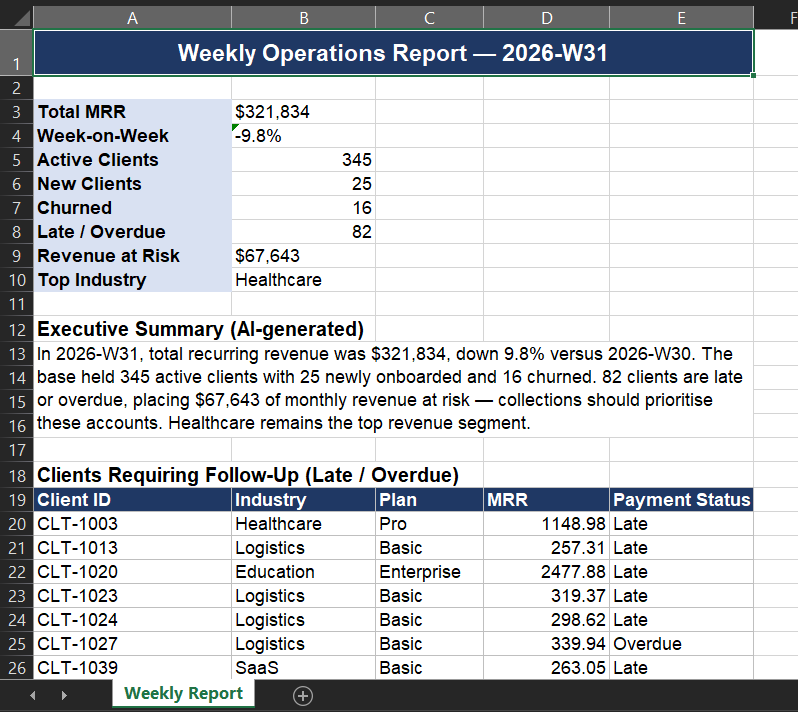

# AI-Powered Automated Reporting Pipeline

Turns a messy weekly operational data export into a clean, formatted Excel
report **and** an AI-written executive summary — with zero manual work.



## Problem
Ops and Client Success teams spend hours every week cleaning exports and
hand-writing status reports. This pipeline does the whole cycle automatically:
ingest → clean → measure → report → narrate.

## Pipeline
1. **Ingest** a raw two-week ops export (deliberately messy: `$`-formatted
   numbers, blanks, duplicates, inconsistent casing).
2. **Clean & validate** — remove duplicates, normalise text, coerce currency
   strings to numbers, handle missing values.
3. **Compute KPIs** — total MRR, week-on-week change, active/new/churned
   clients, late & overdue payments, revenue at risk, top industry.
4. **AI executive summary** — the KPIs are sent to an LLM (Google Gemini) which
   writes a 3-4 sentence leadership summary highlighting risk and a next action.
5. **Formatted Excel report** — a styled workbook with a KPI block, the AI
   summary, and a follow-up list of late/overdue clients.

## Results (sample run)
- Cleaned 810 → 800 rows, removed 10 duplicates.
- Flagged **82 clients** late/overdue, **$67K monthly revenue at risk**.
- Full report + written summary generated in seconds.

## Tech Stack
Python (Pandas, openpyxl), Google Gemini API.

## Files
- `generate_ops_data.py` — builds the messy sample export
- `reporting_pipeline.py` — the full clean → KPI → AI summary → Excel pipeline
- `weekly_ops_raw.csv` — sample input
- `weekly_ops_report.xlsx` — generated report
- `executive_summary.txt` — generated AI summary

## Run it
```bash
export GEMINI_API_KEY="your_key"   # optional; falls back to a template summary
python reporting_pipeline.py
```
